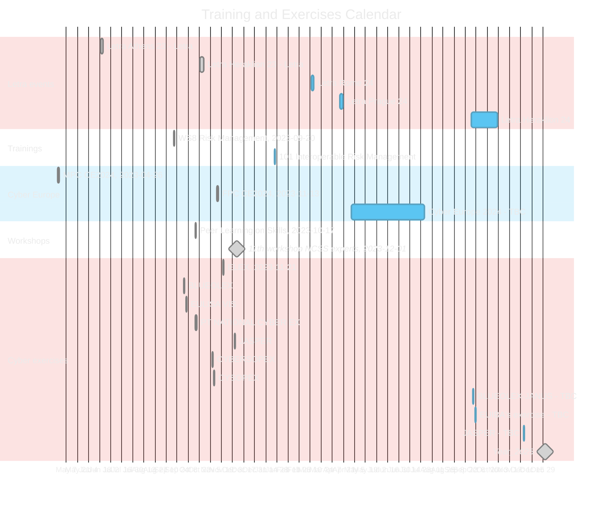
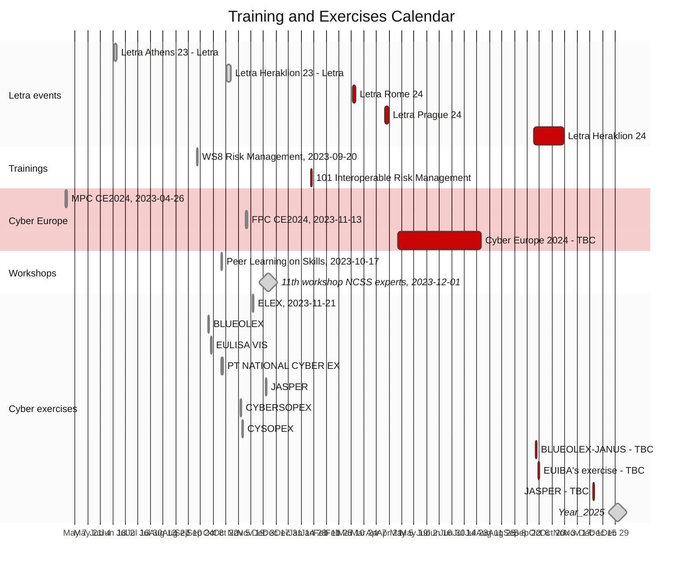

# [The European Union Agency for Cybersecurity (ENISA)](enisa.europa.eu)
## Capacity Building Unit (CBU)
### Training & Exercises (Trex) sector's event calendar

Dark mode diagram

#### Training and Exercises event list
##### 2024
###### Learning & Training (Letra) events
- Letra Rome 24, 2024-03-12, 3d
- Letra Prague 24, 2024-04-17, 3d
- Letra Heraklion 24, TBC 2024-10, 3d-5d
###### other trainings
- 101 Interoperable Risk Management,	2024-01-25, 1d
###### Cyber Europe
-  CE2024, TBC, summer 2024, 5d
###### Cyber exercises
-  BLUEOLEX-JANUS, TBC, 2024-10-02, 1d
-  EUIBA's exercise, TBC, 2024-10-05, 1d
-  JASPER, TBC, 2024-12-05, 1d
##### Past
###### Learning & Training (Letra) events
- Letra Athens 23, 2023-06-19, 3d
- Letra Hearklion 23, 2023-10-23, 5d
###### other trainings
- WS8 Risk Management, 2023-09-20, 1d
###### Workshops
- Peer Learning on Skills, 2023-10-17, 1d
- 11th workshop NCSS experts, 2023-12-01, 1d
###### Cyber Europe
- MPC CE2024, 2023-04-26, 2d
- FPC CE2024, 2023-11-13, 2d
###### Cyber exercises
- ELEX, 2023-11-21: ELEX2023, 2023-11-21, 1d
- BLUEOLEX 2023-10-02, 1d
- EULISA VIS, 2023-10-05, 1d
- PT NATIONAL CYBER Ex, 2023-10-17, 2d
- JASPER, 2023-12-05, 1d
- CYBERSOPEX, 2023-11-07, 1d
- CYSOPEX, 2023-11-09, 1d
