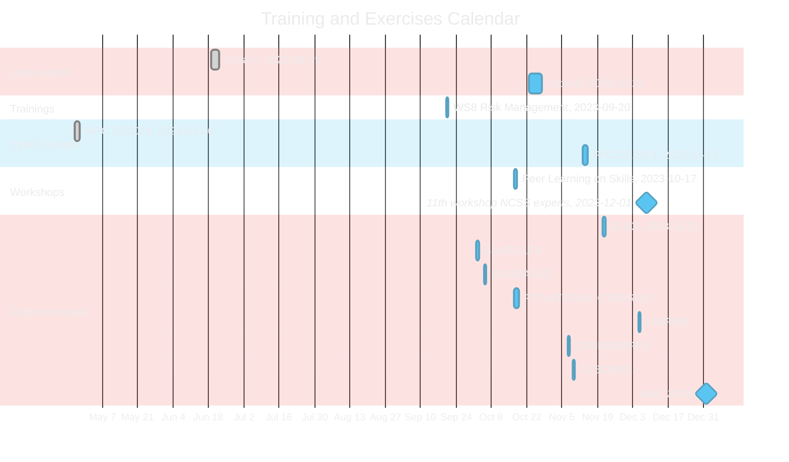
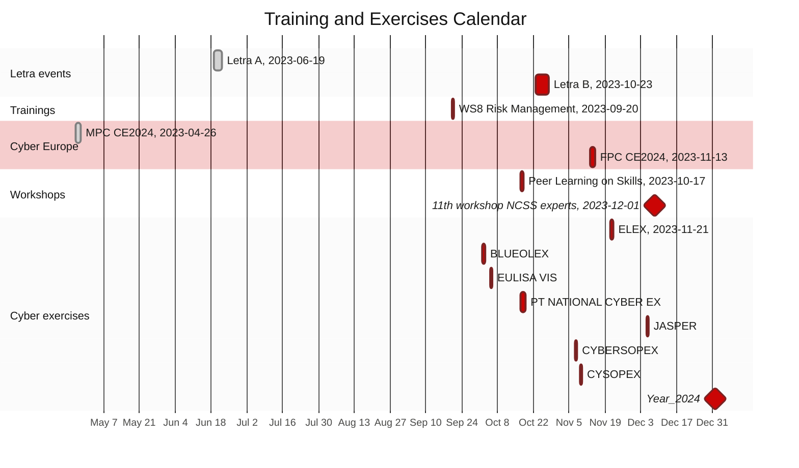

# [The European Union Agency for Cybersecurity (ENISA)](enisa.europa.eu)
## Capacity Building Unit (CBU)
### Training & Exercises (Trex) sector's event calendar

Dark mode diagram

#### Training and Exercises event list
##### Learning & Training (Letra) events
- Letra A, 2023-06-19, 3d
- Letra B, 2023-10-23, 5d
##### other trainings
- WS8 Risk Management, 2023-09-20, 1d
##### Workshops
- Peer Learning on Skills, 2023-10-17, 1d
- 11th workshop NCSS experts, TBC
##### Cyber Europe
- MPC CE2024, 2023-04-26, 2d
- FPC CE2024, 2023-11-13, 2d
##### Cyber exercises
- ELEX, 2023-11-21: ELEX2023, 2023-11-21, 1d
- BLUEOLEX 2023-10-02, 1d
- EULISA VIS, 2023-10-05, 1d
- PT NATIONAL CYBER Ex, 2023-10-17, 2d
- JASPER, 2023-12-05, 1d
- CYBERSOPEX, 2023-11-07, 1d
- CYSOPEX, 2023-11-09, 1d
