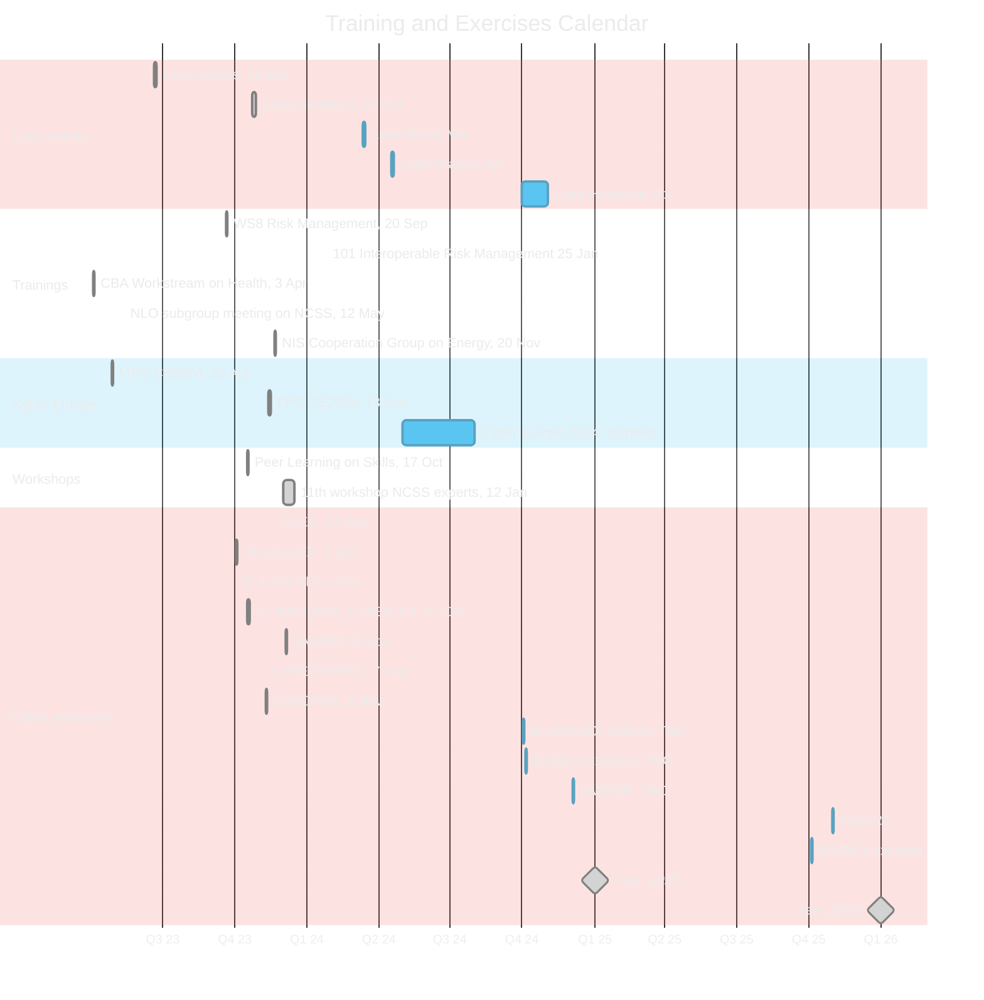

```mermaid
%%{
  init: {
    'theme': 'base',
    'themeVariables': {
      'darkmode': 'true',
      'fontFamily': 'Arial',
      'primaryColor': '#5BC5F2',
      'primaryTextColor': '#EBEBEB',
      'secondaryColor': '#F9B233',
      'secondaryTextColor': '#EBEBEB',
      'tertiaryColor': '#EE756D',
      'tertiaryTextColor': '#EBEBEB',
      'lineColor': '#1D1D1B'
    }
  }
}%%
gantt
  title Training and Exercises Calendar
  dateFormat YYYY-MM-DD %%Input date format. The default input date format is YYYY-MM-DD
  axisFormat Q%q %y
  tickInterval 3month
%%displayed gantt bar info
  section Letra events
    Letra Athens, 19 Jun: done, Letra202306, 2023-06-19, 3d
    Letra Heraklion, 23 Oct: done, Letra202310, 2023-10-23, 5d
    Letra Rome Mar: Training45363, 2024-03-12, 3d
    Letra Prague Apr: Training45399, 2024-04-17, 3d
    Letra Heraklion Oct: Training45565, 2024-09-30, 33d
  section Trainings
    WS8 Risk Management, 20 Sep: done, TRAINING45189, 2023-09-20, 1d
    101 Interoperable Risk Management 25 Jan: virtual_workshop45316, 2024-01-25, 1d
    CBA Workstream on Health, 3 Apr: done, 2023-04-03, 2d
    NLO subgroup meeting on NCSS, 12 May: done, 2023-05-12, 1d
    NIS Cooperation Group on Energy, 20 Nov: done, 2023-11-20, 1d
  section Cyber Europe
    MPC CE2024, 26 Apr: done, Conference45042, 2023-04-26, 2d
    FPC CE2024, 13 Nov: done, CONFERENCE45243, 2023-11-13, 2d
    Cyber Europe 2024, summer: Exercise45413, 2024-05-01, 92d
  section Workshops
    Peer Learning on Skills, 17 Oct: done, physical_workshop45216, 2023-10-17, 1d
    11th workshop NCSS experts, 12 Jan: done, virtual_workshop45261, 2023-12-01, 15d
  section Cyber exercises
    ELEX, 21 Nov: done, ELEX2023, 2023-11-21, 1d
    BLUEOLEX, 2 Oct: done, EXERCISE45201, 2023-10-02, 1d
    EULISA VIS, 5 Oct: done, EXERCISE45204, 2023-10-05, 1d
    PT NATIONAL CYBER EX, 17 Oct: done, EXERCISE45216, 2023-10-17, 2d
    JASPER, 5 Nov: done, EXERCISE45265, 2023-12-05, 1d
    CYBERSOPEX, 7 Nov: done, EXERCISE45237, 2023-11-07, 1d
    CYSOPEX, 9 Nov: done, EXERCISE45239, 2023-11-09, 1d
    BLUEOLEX-JANUS, TBC: Exercise45567, 2024-10-02, 1d
    EUIBA's exercise, TBC: Exercise45570, 2024-10-05, 1d
    JASPER, TBC: Exercise45631, 2024-12-05, 1d
    ELEX25: Exercise45962, 2025-11-01, 1d
    EUIBA's exercise: Exercise45204, 2025-10-05, 1d  
    
%%  Year_2023: done, milestone, Year23, 2023-01-01, 0d
%%  Year_2024: done, milestone, Year24, 2024-01-01, 0d
Year_2025: done, milestone, Year25, 2025-01-01, 0d
Year_2026: done, milestone, Year26, 2026-01-01, 0d

```
