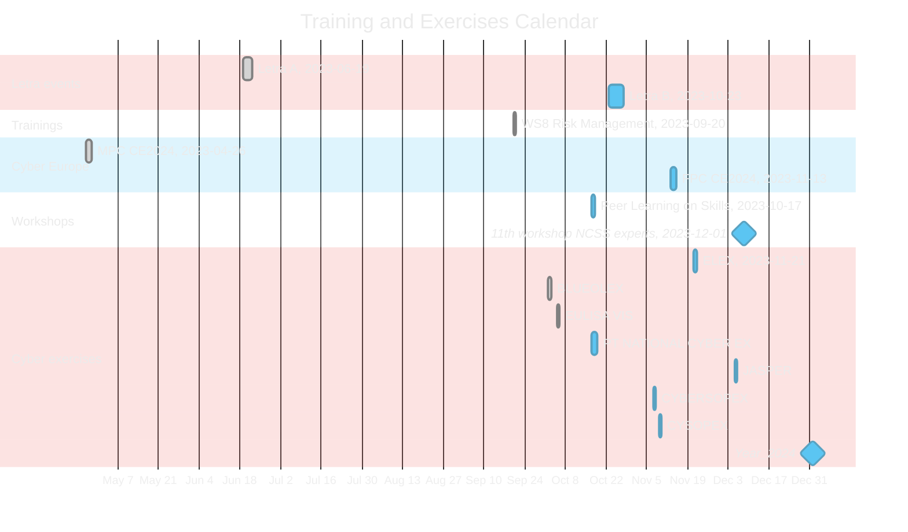

```mermaid
%%{
  init: {
    'theme': 'base',
    'themeVariables': {
      'darkmode': 'true',
      'fontFamily': 'Arial',
      'primaryColor': '#5BC5F2',
      'primaryTextColor': '#EBEBEB',
      'secondaryColor': '#F9B233',
      'secondaryTextColor': '#EBEBEB',
      'tertiaryColor': '#EE756D',
      'tertiaryTextColor': '#EBEBEB',
      'lineColor': '#1D1D1B'
    }
  }
}%%
gantt
  title Training and Exercises Calendar
  dateFormat YYYY-MM-DD %%Input date format. The default input date format is YYYY-MM-DD
  axisFormat %b %e
  tickInterval 2week
%%displayed gantt bar info
  section Letra events
    Letra A, 2023-06-19: done, Letra202306, 2023-06-19, 3d
    Letra B, 2023-10-23: Letra202310, 2023-10-23, 5d
  section Trainings
    WS8 Risk Management, 2023-09-20: done, TRAINING45189, 2023-09-20, 1d
  section Cyber Europe
    MPC CE2024, 2023-04-26: done, CE24, 2023-04-26, 2d
    FPC CE2024, 2023-11-13: CONFERENCE45243, 2023-11-13, 2d
  section Workshops
    Peer Learning on Skills, 2023-10-17: physical_workshop45216, 2023-10-17, 1d
    11th workshop NCSS experts, 2023-12-01: milestone, virtual_workshop45261, 2023-12-01, 15d
  section Cyber exercises
    ELEX, 2023-11-21: ELEX2023, 2023-11-21, 1d
    BLUEOLEX: done, EXERCISE45201, 2023-10-02, 1d
    EULISA VIS: done, EXERCISE45204, 2023-10-05, 1d
    PT NATIONAL CYBER EX: EXERCISE45216, 2023-10-17, 2d
    JASPER: EXERCISE45265, 2023-12-05, 1d
    CYBERSOPEX: EXERCISE45237, 2023-11-07, 1d
    CYSOPEX: EXERCISE45239, 2023-11-09, 1d
%%  Year_2023: milestone, Year23, 2023-01-01, 0d
Year_2024: milestone, Year24, 2024-01-01, 0d
```
